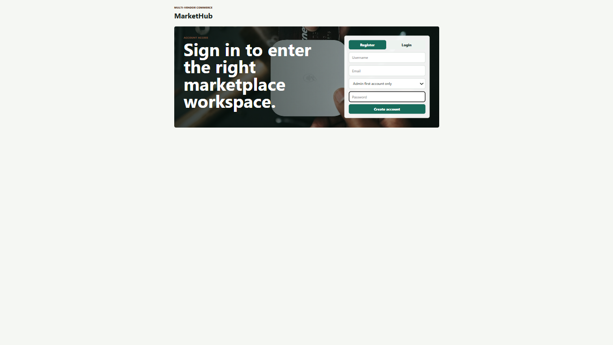
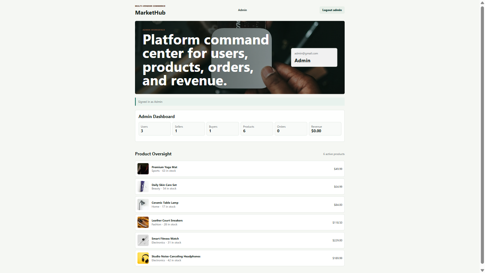
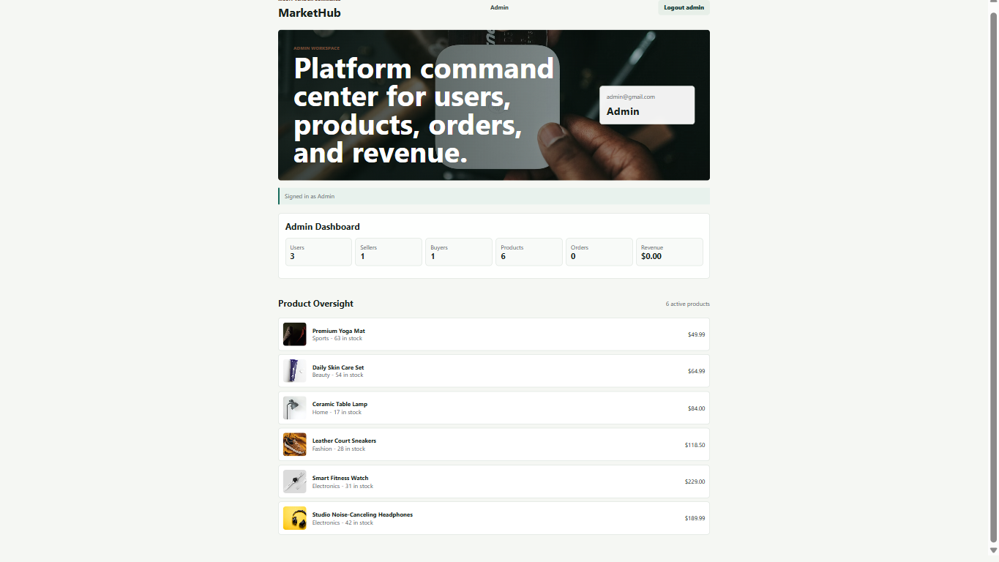
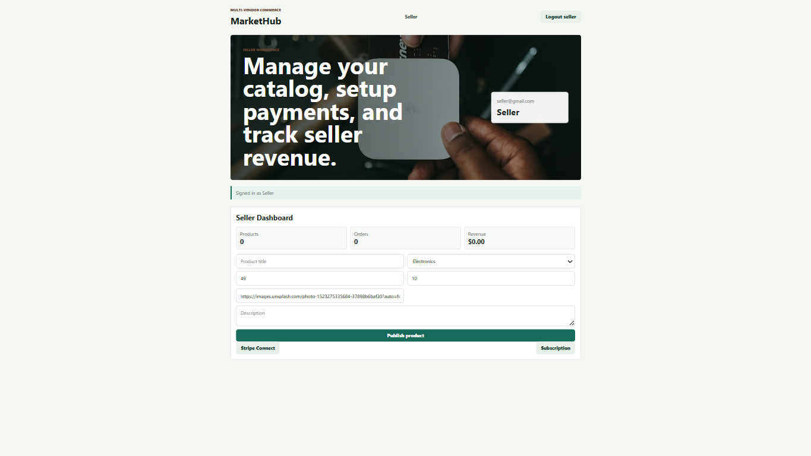
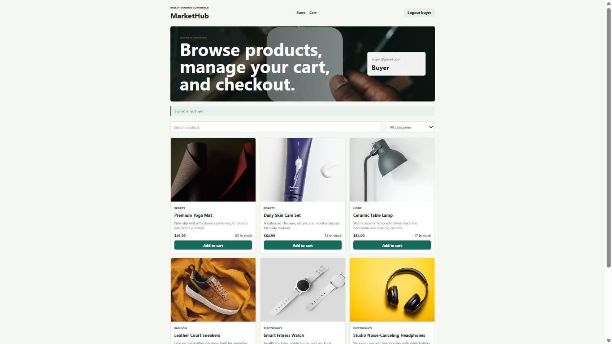
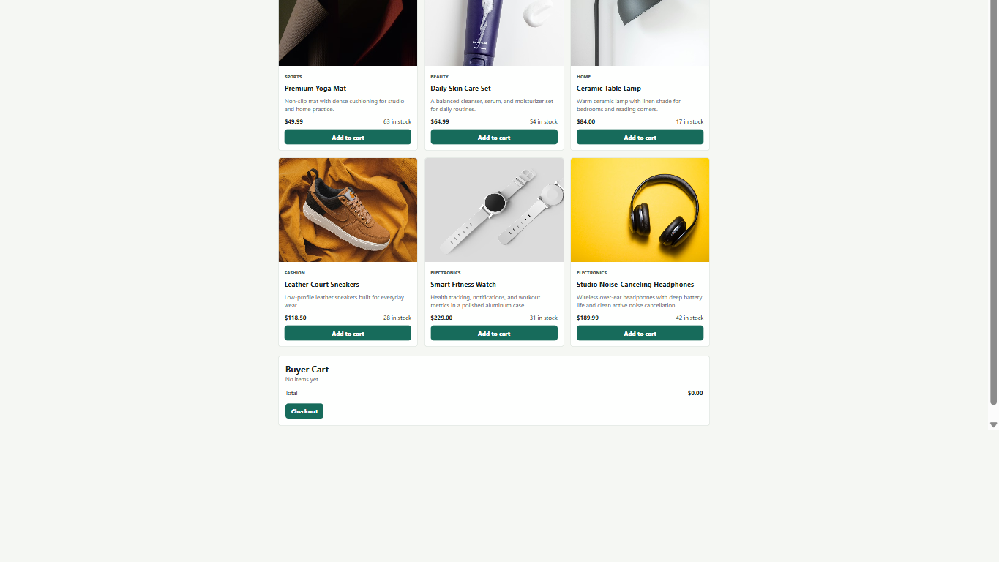

# Enterprise Multi-Vendor Marketplace

Enterprise Multi-Vendor Marketplace is a full-stack marketplace built with an Angular frontend and an ASP.NET Core C# backend. It separates the buyer, seller, and admin experiences so each role sees only the workspace that belongs to them.

The project is intentionally structured as a senior-level full-stack foundation: backend endpoints, contracts, services, and models are split into clear folders; frontend routing, page logic, API services, and shared models are separated; Docker Compose is ready for the app plus PostgreSQL, MongoDB, and Redis.

## Repository

GitHub repository:

```text
https://github.com/brianmahlatini/ENTERPRISE-MULTI-VENDOR-MARKETPLACE.git
```

Local app URLs:

```text
Frontend: http://localhost:4210
Backend health: http://localhost:5050/health
```

## Core Features

- Role-based marketplace access for `Admin`, `Seller`, and `Buyer`.
- First registered user becomes the only initial admin account.
- Later users can register as seller or buyer.
- Login with username/email and password.
- HTTP-only cookie session named `marketplace_session`.
- Buyer storefront with product search, category filtering, cart, and checkout flow.
- Seller dashboard with product publishing, inventory, revenue metrics, Stripe Connect placeholder, and seller subscription placeholder.
- Admin dashboard with platform users, sellers, buyers, products, orders, revenue, and product oversight.
- Seeded product catalog with marketplace product images.
- Docker Compose services for frontend, backend, PostgreSQL, MongoDB, and Redis.

## Screenshots

### Account Access



### Admin Workspace





### Seller Workspace




### Buyer Workspace





## Tech Stack

Frontend:

- Angular 21
- TypeScript
- Angular Router
- Angular HttpClient
- SCSS

Backend:

- ASP.NET Core / .NET 10
- C#
- Minimal APIs
- Role guards
- HTTP-only cookie sessions
- PBKDF2 password hashing with per-password salt

Infrastructure:

- Docker Compose
- PostgreSQL container
- MongoDB container
- Redis container
- Nginx container for production Angular build

Payments and storage placeholders:

- Stripe Checkout
- Stripe Connect
- Stripe seller subscriptions
- S3-compatible product image upload configuration

## Current Data Mode

The backend currently uses an in-memory `MarketplaceStore` so the full role-based flow runs immediately without migrations. PostgreSQL, MongoDB, and Redis are already included in Docker Compose for the next persistence step.

Recommended next backend evolution:

- Move users, carts, orders, payments, seller subscriptions, and audit logs to PostgreSQL with EF Core.
- Move product catalog and reviews to MongoDB.
- Use Redis for product caching, session hardening, and background queue support.
- Add Stripe SDK-backed checkout, Connect onboarding, subscriptions, and webhooks.

## User Roles

### Admin

- The first account registered after backend startup becomes `Admin`.
- Admin sees only the admin workspace.
- Admin dashboard shows platform metrics and product oversight.
- Admin does not see buyer cart or seller product forms in the frontend.

### Seller

- Seller sees only the seller workspace.
- Seller can publish products.
- Seller can view seller product count, order count, and revenue.
- Seller has Stripe Connect and subscription action placeholders.

### Buyer

- Buyer sees only storefront and cart.
- Buyer can browse products, filter by category, search products, add to cart, update cart quantities, and checkout.

## Project Folder Structure

```text
ENTERPRISE-MULTI-VENDOR-MARKETPLACE/
  backend/
    Contracts/
      AuthContracts.cs           Register/login requests, auth result, user DTO
      CartContracts.cs           Cart item request, cart line DTO, cart DTO
      ProductContracts.cs        Product create/update request, product DTO

    Endpoints/
      EndpointSecurity.cs        Current-user lookup, role checks, session cookie creation
      MarketplaceEndpoints.cs    /api route groups for auth, products, cart, checkout, orders, seller, admin

    Models/
      Role.cs                    Admin, Seller, Buyer role enum
      User.cs                    Local user account model
      Product.cs                 Product catalog model
      Order.cs                   Order aggregate model
      OrderItem.cs               Order item model

    Services/
      MarketplaceStore.cs        In-memory marketplace data store and business operations
      SessionCookie.cs           Shared session cookie name

    Properties/
      launchSettings.json        Local ASP.NET launch profiles

    Program.cs                   Application composition, CORS, JSON enum config, service registration
    MarketHub.Api.csproj         ASP.NET Core project file
    Dockerfile                   Backend production container
    .env.example                 Backend environment variable template
    appsettings.json             ASP.NET configuration
    appsettings.Development.json ASP.NET development configuration

  frontend/
    public/
      favicon.ico

    src/
      app/
        models/
          marketplace.models.ts  Shared frontend TypeScript models

        pages/
          dashboard/
            dashboard.page.ts    Role-aware page state and actions
            dashboard.page.html  Role-aware page template
            dashboard.page.scss  Marketplace page styling

        services/
          api.service.ts         Browser API client for ASP.NET backend

        app.config.ts            Angular providers, router, HttpClient
        app.routes.ts            Angular route table
        app.ts                   Root shell component
        app.html                 Root router outlet
        app.scss                 Root shell styles

      environments/
        environment.ts           Frontend API URL configuration

      index.html                 Angular document shell
      main.ts                    Angular bootstrap
      styles.scss                Global styles

    angular.json                 Angular workspace config
    package.json                 Frontend scripts and dependencies
    package-lock.json            Locked frontend dependency versions
    Dockerfile                   Angular production build + Nginx runtime
    nginx.conf                   SPA fallback configuration
    .env.example                 Frontend environment reference

  docker-compose.yml             Backend, frontend, Postgres, MongoDB, Redis
  MarketHub.slnx                 .NET solution file
  package.json                   Root convenience scripts
  .gitignore                     Repository ignore rules
  README.md                      Project documentation
```

## Backend API Routes

Health:

```text
GET    /health
```

Auth:

```text
GET    /api/auth/me
POST   /api/auth/register
POST   /api/auth/login
POST   /api/auth/logout
```

Products:

```text
GET    /api/products
GET    /api/products/{id}
POST   /api/products
PATCH  /api/products/{id}
DELETE /api/products/{id}
```

Buyer cart:

```text
GET    /api/cart
POST   /api/cart/items
PATCH  /api/cart/items/{productId}
DELETE /api/cart/items/{productId}
```

Checkout and orders:

```text
POST   /api/checkout
GET    /api/orders/mine
GET    /api/orders/seller
GET    /api/orders/{id}
```

Seller:

```text
GET    /api/seller/dashboard
POST   /api/seller/connect-account
POST   /api/seller/subscription
```

Admin:

```text
GET    /api/admin/dashboard
```

## Environment Variables

Backend example: `backend/.env.example`

```text
ASPNETCORE_ENVIRONMENT=Development
ASPNETCORE_URLS=http://+:5000
FRONTEND_URLS=http://localhost:4210,http://localhost:4200

POSTGRES_CONNECTION_STRING=Host=postgres;Port=5432;Database=marketplace;Username=marketplace;Password=marketplace
MONGODB_URI=mongodb://mongo:27017/marketplace
REDIS_URL=redis:6379
AUTH_SECRET=replace-with-a-long-random-secret

STRIPE_SECRET_KEY=
STRIPE_WEBHOOK_SECRET=
STRIPE_SELLER_SUBSCRIPTION_PRICE_ID=

AWS_REGION=
AWS_ACCESS_KEY_ID=
AWS_SECRET_ACCESS_KEY=
AWS_S3_BUCKET=
```

Frontend example: `frontend/.env.example`

```text
API_URL=http://localhost:5050/api
```

## Keys Needed Later

Required for production hardening:

- `AUTH_SECRET`: long random value for signed/encrypted production session work.

Required for Stripe:

- `STRIPE_SECRET_KEY`: Stripe secret key for checkout, Connect, and subscriptions.
- `STRIPE_WEBHOOK_SECRET`: webhook signing secret from local Stripe CLI or Stripe dashboard.
- `STRIPE_SELLER_SUBSCRIPTION_PRICE_ID`: recurring Stripe price ID for seller subscriptions.

Required for product image uploads later:

- `AWS_REGION`
- `AWS_ACCESS_KEY_ID`
- `AWS_SECRET_ACCESS_KEY`
- `AWS_S3_BUCKET`

## Local Development

Install frontend dependencies:

```bash
npm --prefix frontend install
```

Run backend:

```bash
dotnet run --project backend/MarketHub.Api.csproj --no-launch-profile --urls http://localhost:5050
```

Run frontend:

```bash
npm --prefix frontend start
```

Open:

```text
http://localhost:4210
```

## Docker

Start the full stack:

```bash
docker compose up --build
```

Start in detached mode:

```bash
docker compose up --build -d
```

Check services:

```bash
docker compose ps
```

View logs:

```bash
docker compose logs --tail=100 backend
docker compose logs --tail=100 frontend
```

Docker ports:

```text
Frontend:   http://localhost:4210
Backend:    http://localhost:5050
PostgreSQL: localhost:5432
MongoDB:    localhost:27017
Redis:      localhost:6379
```

## Useful Commands

Root scripts:

```bash
npm run backend:build
npm run backend:dev
npm run frontend:install
npm run frontend:build
npm run frontend:dev
npm run docker:up
npm run docker:up:detached
```

Direct commands:

```bash
dotnet build MarketHub.slnx
dotnet build backend/MarketHub.Api.csproj
cmd /c npm --prefix frontend run build
cmd /c npm --prefix frontend start
```

## Verification

Before pushing changes:

```bash
dotnet build MarketHub.slnx
cmd /c npm --prefix frontend run build
docker compose config
```

Expected result:

- ASP.NET backend compiles.
- Angular production build compiles.
- Docker Compose configuration is valid.

## GitHub Push

For the first push to the new GitHub repository:

```bash
git init
git add .
git commit -m "Initial enterprise marketplace implementation"
git branch -M main
git remote add origin https://github.com/brianmahlatini/ENTERPRISE-MULTI-VENDOR-MARKETPLACE.git
git push -u origin main
```

If the remote already exists:

```bash
git remote set-url origin https://github.com/brianmahlatini/ENTERPRISE-MULTI-VENDOR-MARKETPLACE.git
git push -u origin main
```

## Production Notes

Before production deployment:

- Replace the in-memory store with PostgreSQL/MongoDB persistence.
- Add database migrations.
- Move auth session signing/encryption to `AUTH_SECRET`.
- Set secure cookies to `Secure = true` behind HTTPS.
- Add request validation and rate limiting.
- Implement Stripe SDK checkout sessions and webhooks.
- Implement product image upload signing.
- Add backend and frontend tests.
- Add CI build checks in GitHub Actions.
